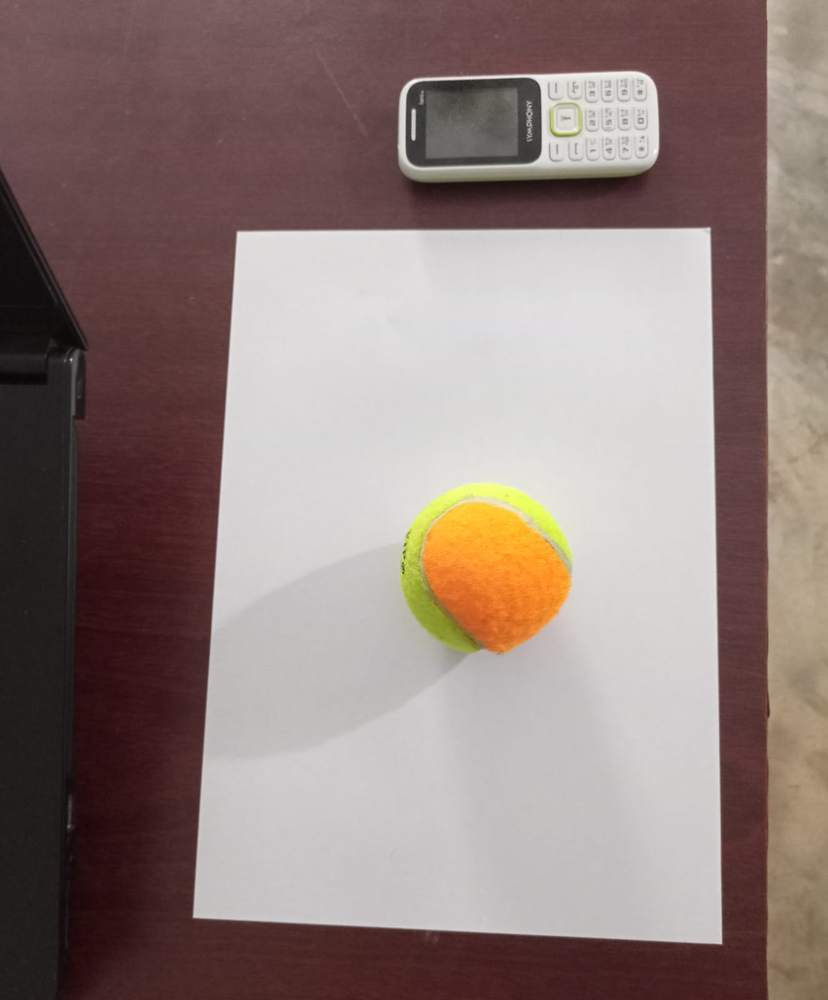
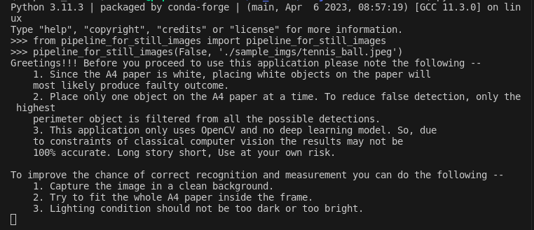
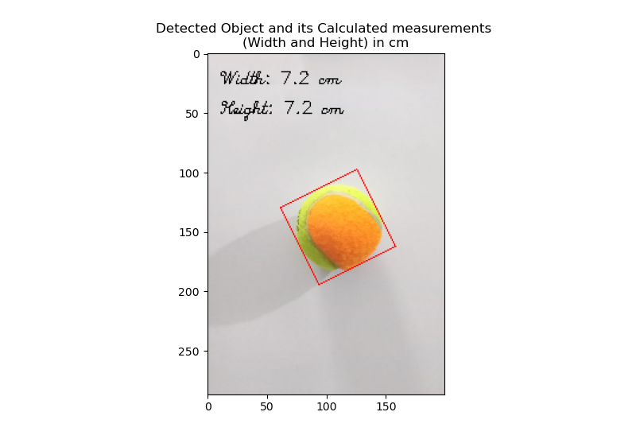

--------------------------------------------------
# VisionMeasure: Object Dimension Measurement with OpenCV
----------------------------------------------

----------------------------------------
## Project Goal

The goal is to develop a system using OpenCV that can be used to reliably measure the dimension of various types of objects in real time using the presence of a known object (an object whose dimension is known) in the frame. 

-----------------------------------------------

## Current Status, Usage, and Project Description

The object to measure should be placed on an A4 paper whose dimensions are known (210 x 297 mm). 

### Caution !!!

Before you proceed to use this application please note the following -- 
    1. Since the A4 paper is white, placing white objects on the paper will 
    most likely produce a faulty outcome.
    2. Place only one object on the A4 paper at a time. To reduce false detection, only the highest 
    perimeter object is filtered from all the possible detections.
    3. This application only uses OpenCV and no deep learning model. So, due 
    to the constraints of classical computer vision, the results may not be 
    100% accurate. Long story short, Use at your own risk.

To improve the chance of correct recognition and measurement you can do the following --
    1. Capture the image on a clean background.
    2. Try to fit the whole A4 paper inside the frame.
    3. Lighting conditions should not be too dark or too bright.

### Usage

The current implementation has a Python script named `pipeline_for_still_images.py`. 

Run this script for detecting objects of interest from a still image and finding the objects' dimensions (width, height) in cm.

    **Object of interest - Largest perimeter object placed on top of the A4 paper.**

**Args**:
    
    prompt_user: whether to prompt the user for image path or, device id. (default: False)
    
    image_path: to use a stock/pre-captured image instead of prompting the user. (default: "./sample_imgs/paint_brush.jpeg")
    
    capturing_device_id: to capture a live image instead of prompting or loading a stock one. (default: None)
    
    visualize: whether to show the output image containing the info of detections. (default: True)
    
    scale: matplotlib_imshow() function visualization scale. (default: 8)

**Returns**: The output image (a rotated bounding box is drawn around the object of interest. The calculated dimensions (width, height) are also shown on the output image).

#### Demo of using the application

- Image used

- Running the script

- Result

-------------------------------------------------

## Future Prospect

1. **Real-time detection**: measurement from live capture (currently I don't have a USB Webcam so can't implement it right now).
2. **Dimension Verification**: a validation step can be introduced to ensure the accuracy of the measured dimensions. This could involve comparing the measured dimensions to ground-truth values or using multiple reference objects for calibration.
3. **Custom reference object**: Use a reference object of the user's choosing. 
4. **User Interface**: a simple graphical user interface (GUI) to input images or videos, display the results, and provide some options for customization.

-----------------------------------------------------
